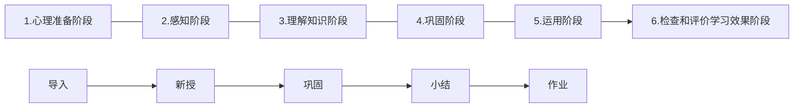

### 课堂教学设计方法与技能

#### 教学设计的一般流程


#### 学习者分析

- **意义**
  - 学习者分析，即教学对象分析，也就是学生学情分析
  - 设计的教学方案是否与学习者的特点相适应，是衡量一个教学设计是否成功的重要指标，是关乎教学成败的重要因素。

> 由于未能分析学习者特征而导致设计者犯的一个错误是，认为全体学习者都是相同的。更为普遍的一个错误是，认为学习者如同设计者自己一样。这就意味着，我们将按我们理解的方式解释事物，运用我们熟悉的例子，运用对我们有效的教学技术。                            ——史密斯

- **框架**

  - 加涅的学习者特征分析框架（**强调差异**）

    ```mermaid
    graph LR
    A[学习者特征]-->B[先天因素]
    A[学习者特征]-->C[发展因素]
    A[学习者特征]-->D[习得因素]
    B-->E[信息输入,如视觉敏度]
    B-->F[内部加工,如信息加工容量]
    B-->G[信息提取,如概念提取速度]
    C-->H[人格特质,如动机特征]
    C-->I[能力,一般能力和差别能力]
    D-->J[智慧技能]
    D-->K[言语技能]
    D-->L[动作技能]
    D-->M[认知策略]
    D-->N[态度]
    ```

  - 史密斯的学习者特征分析框架（**强调差异性和相似性**）

    |        | 相似性                                                       | 差异性                                                       |
    | :----: | :----------------------------------------------------------- | ------------------------------------------------------------ |
    | 稳定的 | 感知能力<br />信息加工类型<br />学习状态                     | 智商<br />认知类型<br />心理属性<br />性别，种族             |
    | 变化的 | 发育过程<br />- 智力<br />- 语言<br />- 心理<br />- 道德<br />- 其他 | 发育状态<br />- 智力<br />- 其他<br />先学知识<br />- 一般的<br />- 特殊的 |

  - 迪克的学习者特征分析框架
    - 起点能力
    - 与学习课题有关的知识
    - 对学科内容和潜在传输系统的态度
    - 学习动机
    - 原有成绩和能力水平
    - 一般学习偏好
    - 对培训组织的态度
    - 群体特征

- **内容**

  ```mermaid
  graph TD
  A-->C[认知特征]
  A-->D[起点能力]
  A-->E[认知结构]
  A-->F[学习风格]
  A[学习者特征]-->B[学习动机]
  ```

  - **认知特征**：感觉知觉、注意记忆、思维方式等方面的特征，了解其特点，进行有针对性地讲解与训练，使教和学有机地结合起来。

    > 高一学生抽象思维能力逐步提高，具备了较好的抽象思维能力，抽象概括水平明显地从经验水平向理论水平转化，能够摆脱具体材料在理论上进行推导、论证，或用理论把事实或材料贯穿起来。思维具有更强的组织性，能比较完整地、按一定的系统讲述自己的思想或意见；能对事物进行分析，找出本质特点。

  - **起点能力**：学生是否具备了学习新知识的基础知识和准备。对学习者起点能力水平的分析多采用测验的方式，起点能力分析分为预备能力分析和目标能力分析。

    | 分类 | 预备能力分析                                                 | 目标能力分析                                                 |
    | ---- | ------------------------------------------------------------ | ------------------------------------------------------------ |
    | 目的 | 明确学习者对于面临的学习是否有必备的行为能力。应该提供给学习者哪些“补救”活动。 | 了解学习者对将要学习的知识已经知道了多少，是否存在错误理解等。 |
    | 方法 | 先预设一个教学起点，将该起点以下的知识技能作为预备能力，并以此为依据编写预测题，从而实现对预备能力的预估。 | 在学程开始之前，就直接使用期末考试题对整个学程的教学目标所要求的能力一并进行预测。 |

    【案例】《电子邮件的发送》部分学习者起点能力分析。

    

  - **认知结构**：学生已有知识的数量、清晰度和组织结构。

    - 可利用性：原有知识结构中是否存在与新学习的知识相关的观念；

    - 可分辨性：可利用的观念与当前所学新观念之间的可分辨程度；

    - 稳固性：可利用的观念是否稳定、牢固，即巩固程度。

    - 分析方法：概念图

      

  - **学习风格**：学习者在长期的学习活动中形成的具有个人特征的学习习惯和学习倾向，包括学习情绪、态度、动机、坚持性以及对学习环境、学习内容等方面的偏爱。
    - 知觉风格：场独立型/场依存型
    - 解决问题的风格：沉思型/冲动型

  - **学习动机**：引起或维持学习者的学习活动、并使学习活动指向学习目标的心理倾向。
    - 一般分类：内部动机与外部动机
    - 奥苏贝尔成就动机：认知内驱力，自我提高内驱力，附属内驱力
    - 要注意采取科学策略激发学生的学习动机

- **案例**

  ​        *初中第二册（上）“添加演示文稿” 。本课的主要任务是掌握如何添加演示文稿的内容，重点掌握在幻灯片中添加文字的方法。  学习者特征分析：*
  ​        在学习本课之前，学生已经掌握了鼠标和键盘的操作、对演示文稿幻灯片有了初步的认识，以及如何拟定演示文稿内容的能力；  学生具有一定的网络学习环境下学习的经验，计算机操作熟练，具有初步的网上学习的技能。**（知识基础、技能）**13—14岁的学生，思维活跃，课堂上喜欢表现自己，自主学习能力已经有了初步形成，能根据模仿完成相应操作；**（学习能力）**他们对信息技术学习有浓厚的兴趣，求知欲强，对什么方法添加演示文稿很感兴趣；**（学习兴趣、态度）**但是，对理论性强的知识点不易理解，认知较直观，而对具体操作易于接受，自控能力还不强，需要教师做好课堂的调控。**（ 认知能力、学习动机）**这个年龄段的学生具有独立思考的能力，但受外界影响还是比较大，一般属于场依存型的学生，喜欢从个人角度分析、解决问题，喜欢摸索找到一个比较适合自己的添加文稿的方法，喜欢自己动手操作从而掌握其中的知识点。**（学习风格分析)**   

  - **提示**
    - 受生理的、心理的、社会文化等因素的影响，学习者个体之间既表现出一些共性的、稳定性的特征，又表现出多样化的差异。
    - 分析学习者特征时，既需要考虑学习者之间的稳定的、相似的特征，又要分析学习者之间的变化的、差异性的特征。相似性特征的研究可以为集体化教学提供理论指导，差异性研究能够为个别化教学提供理论指导。
    - 分析方法：观察、访谈、问卷、测验等


#### 教学内容分析

- **意义**
  - 教师认真研读课程标准、教材的基础上，合理选择和组织教学内容，确定教学内容的**知识点**以及**知识点之间的关系**，明确教学内容的**性质**，确定教学的**重点与难点**。把综合的、复杂的整体内容分解为各个相对独立、简单的组成部分。
  - 把经过分析而划定的各个部分，按照一定的方式、方法进行安排，或把分散的、零散的内容组成具有一定结构的整体，为教学顺序的合理安排、教学策略的优化选择与应用提供科学的依据。

- **内容**

  - **明确<u>知识点</u>及<u>重难点</u>**

    - **知识点**：学科的基本概念、原理和基本技能等，知识点以及知识点之间的关系构成了一门学科或一节课的基本知识结构。
    - **重点**：是教材中最重要、最基本的中心内容，即基本知识和基本技能。
    - **难点**：是教师难于传递、学生难于接收的知识、方法和能力信息。即学生学习过程中阻力较大或难度较高的某些关节点，比较困难的知识点或问题不容易解决的地方。或者具有偏见、错误认识的地方。

    > 【例如】信息、信息的特征
    > 重点：信息与人类社会的关系、信息的基本特征
    > 难点：信息的基本特征

  - **判断知识点的<u>性质</u>，为教学策略的选择、教学内容的组织提供依据**

    - 概念性的知识，是需要理解和记忆的，原理性的是需要理解、应用的，技能型的是需要操作练习的，它们对教学方法、教学组织形式、教学过程、教学情境的创设、教学环境等都提出了不同的要求。

    > 【例如】《信息及其特征》教学内容，基本上是事实与概念介绍，教学内容抽象、乏味、枯燥

  - **确定知识点之间的关系，方便确定教学过程的程序**

    - 知识点之间的关系有从属关系、并列关系两种。
    - 在信息技术学科所包含的知识点之间，既有相对的独立性，也存在着某种必然的逻辑联系。

    > 【例如】计算机的信息输入技术、信息处理技术、信息存储技术是信息技术课程中的知识点，它们之间的关系是并列关系，而键盘输入技术、扫描输入技术、语音输入技术等又从属于信息输入技术。
    >
    > 

  - **确定教学内容的类型，以便确定内容的组织方式与教学方法**

    ```mermaid
    graph TD
    A[教学内容]-->B[知识类]
    A-->C[技能类]
    A-->D[情感态度类]
    B-->E[陈述性知识]
    B-->F[程序性知识]
    B-->G[元认知知识]
    C-->H[智慧技能]
    C-->I[动作技能]
    D-->J[情感态度]
    D-->K[价值观]
    ```

- **维度**

  ```mermaid
  graph LR
  A[内容分析]-->B[教学范围]
  A-->C["教学重点、难点"]
  A-->D[教学序列]
  B-->E[知识点]
  B-->F["内容性质（概念、原理、技能）"]
  B-->G["知识类型（程序性、陈述性）"]
  B-->H[内容的广度]
  B-->I[内容的深度]
  C-->J["重点：一节课中非讲不可的内容，是基础知识"]
  C-->K["难点：学生不易理解的知识，或不易掌握的技能技巧"]
  D-->L[逻辑顺序]
  D-->M[新旧关系]
  ```


- **提示**
  - **选择与组织教学内容，不要局限于教材（教科书） **
    - 选择信息技术领域中具有一定稳定性的、迁移性强的知识
    - 补充选择前沿的信息技术知识和技能
    - 教学内容要重视应用，以激发学生的学习兴趣
    - 注意与其他科目的整合

- **案例**

  **数据的采集、分析和可视化表达**
        本节内容是浙教版《信息技术基础》第二章第一节的内容，本节课安排1课时。本章内容的知识点包括信息的来源、信息的获取方法，属于陈述性知识；主要任务是使学生在明确信息的来源及获取途径基础上，让学生学会用正确、多样的方法获取信息，并能对信息进行准确评价。本节内容是本章的第一节，是之后几小节内容的概括性介绍，在本章中起到入门铺垫的作用。

  

#### 教学目标设计编写

- **意义**
  - **教学目标是对<u>学习者</u>通过教学后应该表现出来的可见行为的具体的、明确的表述。是教学的出发点与归宿。**
    - 指向**学习者**，而非教育者、或教学媒体。
    - 用于描述教学**完成**之后的行为。
    - 用于描述那些**可见**的行为。

> 【例1】在教学过程中，教师能够正确使用媒体促进学生的记忆效果。
> 【例2】通过本节课的教学，教师能够正确引导学生认识什么是信息社会。
> 【例3】通过本节课的学习，理解什么是信息技术。

- **依据**
  - 课程标准
  - 教学内容
  - 学生实际
  - 社会需要

- **理论**

  - 教学目标分类体系

    - 布卢姆：认知、情感、操作

      

    - 加涅：言语信息、智慧技能、认知策略、动作策略、情感态度

    - 三维教学目标：知识与技能、过程与方法、情感态度价值观

      ```mermaid
      graph TD
      A[教学目标]-->B[知识与技能]
      A-->C[过程与方法]
      A-->D[情感态度价值观]
      B-->E[基础知识]
      B-->F[基本技能]
      C-->H[知识获取]
      C-->I[知识加工]
      C-->J[知识表达与交流]
      D-->K[内隐]
      ```

    - 学科核心素养

- **三维目标**

  - **知识与技能**（学什么）

    | 序号 | 层次 | 含义                                                         | 范例                                                         |
    | :--: | :--: | ------------------------------------------------------------ | ------------------------------------------------------------ |
    |  1   | 了解 | 对所学习的符号和事实性知识的记忆，并能与其所代表的事物建立实质性的联系 | 说出信息获取的途径                                           |
    |  2   | 理解 | 是对具有一定抽象性、概括性的语义知识的掌握                   | 理解IP地址的分类和基本结构                                   |
    |  3   | 应用 | 建立在理解的基础之上，指在归纳、总结的基础上，将学习到的知识用于新的问题情境 | 根据已有的二进制知识，计算出每类IP地址所能容纳的网络个数和主机个数 |

  - **过程与方法**（怎么学）

    | 序号 | 层次 | 含义                                                         | 范例                                                   |
    | ---- | ---- | ------------------------------------------------------------ | ------------------------------------------------------ |
    | 1    | 经历 | 学生在独立或者合作参与活动的过程中，经历知识形成的过程，建立感性认识 | 通过观看……视频，初步获得网络在生活中所起作用的感性认识 |
    | 2    | 体验 | 学生能够对所获得的知识进行一定的解释和应用                   | 通过观摩优秀PPT作品，体验到多媒体课件的作用            |
    | 3    | 探索 | 学生经历信息技术学科中的“发现问题、分析和解决问题”的过程     | 在合作完成小组网页的制作过程中，掌握网页开发的一般方法 |

    表述三要素：**学习的知识内容**（或研究课题的内容、实践活动的内容）、**学习过程的方式**、**能力发展的内容**

    > 【例如】通过上网查找“珍惜动物保护”的资料，迅速准确地获取相关信息并进行整合加工，小组成员共同完成专题报告的过程中，相互鼓励、相互帮助，培养探究能力、初步形成合作学习的意识与能力。

  - **情感态度价值观**（学得怎么样）

    - **情感**不仅指学习信息技术的兴趣与热情，而且也指学生内心对信息技术应用的体验；

    - **态度**是人内在体验的外在表现，它不仅指学习的态度，更被用于描述学生在学习信息技术、利用信息技术过程中的求实的科学态度；

    - **价值观**是对价值的看法，不仅强调学生个人的价值，而且强调个人价值与社会价值的统一。

    - 【常用词】：遵守、接受、欣赏、关注、拒绝、摈弃等（认同）
                             形成、具有、树立、热爱、坚持、追求等 （内化）

      > 【例如】
      > 1.通过欣赏……感受运用信息技术创作作品的乐趣，提高学习信息技术的兴趣。
      > 2.通过分析……发展评价能力及与同伴交流合作的意识和能力，增强社会责任感和团结协作的精神，形成有意识地遵守网络使用的法律和网络道德品质  。- 

  - 案例

    - 案例1

      **认识电子表格**
      【知识与技能】
      1、能够熟练操作Excel表格的启动与关闭
      2、能够按照需要熟练创建、编辑和保存电子表格文件
      3、能够熟练输入、编辑和修改工作表中的数据
       【过程与方法】
          通过比较Excel软件的界面与以前所学的PowerPoint的异同，熟悉Excel软件的界面的组成，培养发现问题、分析问题和解决问题的能力。通过自主完成任务，形成熟练使用电子表格解决实际问题的能力。
      【情感态度价值观】  
          在应用电子表格记录运动会成绩并进行排序的过程中，提高对电子表格的学习兴趣，培养主动应用电子表格解决实际问题的意识。

    - 案例2

      **信息及其特征**
      【知识与技能】
      1.能够列举生活和学习中的各种信息，感受信息的丰富性与多样性；2.举例说明信息的一般特征。
       【过程与方法】
      1.通过对生活学习中信息的列举，进一步认识信息技术在社会生产生活中的作用，发现归纳得出信息的特征，养成分析问题解决问题的能力；2.养成从日常生活、学习中发现或归纳需要利用信息和信息技术解决的问题的习惯，能通过问题分析确定信息需求。
      【情感态度价值观】  
      理解信息在学习与生活中的重要性，激发对信息技术强烈的求知欲，培养积极主动学习和应用信息技术解决问题的意识与态度。

- **核心素养**

  

  - 案例
    1. 初步了解在进行信息系统应用过程中，数据面临着一系列安全问题，能描述数据存在的安全问题（**信息意识**）。
    2. 能够描述密码、密匙以及在对称与非对称密码体制下的加、解密过程，并能基于知识点间的关联性学习，形成初步的将碎片化知识系统化的意识和能力（**数字化学习与创新**）。
    3. 通过加密博弈实验，初步学会用学过的程序设计语言进行数据加密程序的设计（**计算思维**）。初步形成主动进行新知顺应、同化的意识和能力（**数字化学习与创新**）。
    4. 通过对数据的安全防范技术的学习，提升信息安全意识，能主动保护自身数据的安全和尊重他人的数据安全（**信息社会责任**）


#### 教学设计后续部分

- **教学策略的选择**（教学方法、教学组织形式）
- **教学资源的准备**（资源、计算机等）
- **<u>教学过程的设计</u>**
- **板书的设计** 


#### 教学过程的构想

- 依据学习过程的六个基本阶段（六对应五）




#### 教学过程的写法

- 按照**纵向的教学进程**写，写出每部分教师打算怎么教、期望学生怎么学

  - 导入

    - 好的导入，如同桥梁，联系着旧课和新课；如同序幕，预示着后面的高潮和结局；如同路标，引导着学生的思维方向。

    > 【例如】介绍计算机里的画图时，运用类比的方式，从“上一节美术课”引起学生的学习兴趣。
    > （同学们，今天我们要上一节美术课，也许你们会感到奇怪，这里又没有画笔，又没有颜料，怎么能上美术课呢？别着急，我们所需要的工具全在计算机里面，一样都不少。） 

  - 新授

    - 首先要理顺**两个序**：一是**教材本身的序**，教学内容的组织必须立足于揭示和呈现教材内部的知识逻辑，以培养学生正确的逻辑思维，使他们有一个清晰的思路，掌握明确的主线。二是**学生认识的序**，遵循学生认知规律，如由已知到未知，由感知到理解、到巩固、到应用，由易到难，由简到繁等。
    - 关注**重难点的突破**、关注**知识点之间的衔接与过渡**，据此安排教学内容和教学时间。
    - **教学方法与组织形式**的应用：所确定的教学方法与教学组织形式如何应用
    - **教学媒体**的应用：设计的课件什么时候应用，怎样突出重点，突破难点，知识如何巩固和迁移

  - 巩固

    - 主要是指随堂练习。
    - 预测学生学习情况，设计合适的课堂练习。
    - 针对不同学生设计差异性的练习。

  - 小结

    - 对教学内容进行总结

  - 作业

    - 对课堂表现的评价，布置课后作业

- **纵横结合写法**

  |                                              |                |    教学过程    |              |              |          |
  | :------------------------------------------: | :------------: | :------------: | :----------: | :----------: | :------: |
  |                 **教学进程**                 | **教师的活动** | **学生的活动** | **教学意图** | **媒体应用** | **时间** |
  |                 **组织教学**                 |                |                |              |              |          |
  |                   **导入**                   |                |                |              |              |          |
  | **基础部分<br />（新授、巩<br />固练习等）** |                |                |              |              |          |
  |                   **结语**                   |                |                |              |              |          |

  - 讲授课

    | 教学进程（环节）                                |                                           | 教师活动                                                     | 学生活动               | 教学意图                                                     | 媒体 | 时间 |
    | ----------------------------------------------- | ----------------------------------------- | ------------------------------------------------------------ | ---------------------- | ------------------------------------------------------------ | ---- | ---- |
    | **情境导入，激发兴趣（建立联系）**              |                                           | [展示] ：展示===视频，并提出----要求                         | 学生观看、记录、思考等 | 提供学习情境，促使学生主动形成新旧知识的内在联系；设置悬念，引起学习兴趣、激发学习动机 | ===  | 2‘   |
    | **解析概念原理\列举事例（案例分析）、归纳总结** | 知识点1：==<br />——<br />知识点2:==<br /> | [讲解]：“==”概念，提出===问题
[过度衔接]：====
[任务]：布置===任务，=== | ===                    | 师生在观察、分析或者合作探究的过程中，归纳总结出概念、规则，从而认识事物特征、识记事实、理解概念。（或采取演绎型，由点到面）
培养什么素养 | ===  | ==   |
    | **强化训练，巩固知识**                          |                                           | [任务单]：===                                                | ===                    | **通过强化训练达到知识与技能习得的目的**                     | ===  | ==   |

  - 练习课

    | 教学进程（环节）       | 教师活动                                                     | 学生活动 | 教学意图                                                     | 教学媒体 | 时间 |
    | ---------------------- | ------------------------------------------------------------ | -------- | ------------------------------------------------------------ | -------- | ---- |
    | **导入**               | [展示]：===                                                  | ==       | 激发学习欲望，明确学习目标                                   |          |      |
    | **呈现学习任务**       | [呈现任务单]：===。
[任务分析说明]：                          | ==       | 通过任务单和学习任务的描述使学生明确学习的方向、方法，明确练习的要点与程序。以便顺利开展学习活动，加深对相关知识的理解、技能的巩固 |          |      |
    | **提供学习资源与帮助** | [范例]：=====
给出可供参考的范例、[学习资源]：===组织学生描述观察的对象 | 分析范例 | 通过对范例的分析，进一步明确学习目标以及评价要求             |          |      |
    | **自主练习**           | 指导===                                                      | 操作练习 |                                                              |          |      |
    | **归纳总结**           |                                                              |          |                                                              |          |      |

  - 探究课

    | 教学进程（环节）           | 教师活动                                                     | 学生活动                                                     | 教学意图                                                     | 教学媒体 | 时间 |
    | -------------------------- | ------------------------------------------------------------ | ------------------------------------------------------------ | ------------------------------------------------------------ | -------- | ---- |
    | **创设情景，确定探究任务** | [播放课件]教师利用多媒体课件（===等）创设问题情境；就多媒体课件展示的内容直接提出问题。 | =====                                                        | 激发学生需要解决问题的兴趣；引导学生通过多媒体课件创设的情境去发现问题，明确要解决的问题就是需要探究的任务 | ==       | ===  |
    | **形成问题，明确探究方向** | [小组合作学习]：给出学习任务“====”，引导学生分组，确定角色、分工 | 各小组根据探究的任务进行分析、协商和思考，提出解决问题的合理猜想和假设，再依据自己小组提出的假设明确探究的具体方向，制定探究的初步方案。 | 培养学生担当、协同学习的意识，培养发现问题、分析问题的能力   |          |      |
    | **小组协作，开展探究活动** | 巡回指导、引导                                               | 根据提出的探究方案小组通过交流、协作、实验、分析等活动开展探究活动，获得数据或结果，验证自己小组提出的假设。 | 探究问题，获取知识技能，培养合作的能力、数字化应用能力       |          |      |
    | **交流汇报，评价探究结果** | **引导学生汇报交流。也可以扩充探究问题的深度和广度，迁移学生对知识的理解。** | **汇报展示小组对解决问题的建议、预言、推论或其他合适的解决方案等，全班评价、交流得到的结论，反思探究活动中的不足和收获** | **巩固探究成果，建构知识体系，培养评价能力**                 |          |      |

    

#### 教学设计的注意事项

- **心中有目标**：教学情境创设有新意，正确体现目标和重难点，内容充实、适当，环节清晰全面，过渡自然，有效引导学生参与，启发学生思考。
- **心中有学生**：预想学生可能遇到的问题
- **正确区分教师活动和学生活动**：在写教师活动和学生活动时，要重点写出教师和学生做什么、怎么做，而非说什么，并且教师未必完全确定学生一定能答出教师想要的答案。
- **突出教学重点**：教师活动表述不能过于简单空泛，要具体说明教师在教授某个知识点时具体的活动是什么，要向学生呈现哪些教学内容、如何呈现等，在给学生布置任务时，要具体写出学生要完成的任务是什么。
- **每个环节的教学意图要明确**。
- **对不同的教学内容应该如何讲授、学生如何学习的把握**
  - 教师要把时间、重点放在教学重难点上，给予学生充足的时间练习掌握；
  - 理论性强的课程，要尽量避免单纯枯燥的讲解，多配图片和视频引起学生的学习兴趣，并且不要花费太多的时间在理论讲解上；
  - 操作性强的内容，要让每一位学生都能动手实践操作，恰当应用小组合作；

- **教学过程的思路要清晰**：是先讲后练还是先练后讲还是边讲边练，是先讲后任务驱动，还是先合作学习后讲解评价，等等，各个环节过渡衔接要流畅；
- **备课留空间**：重点是明确教学目标，展现教学思路，不能太过于细致，留有调节的余地，也避免束缚师生的手脚。使计划性与灵活性有机结合
- **要有自己的见解**：不要被参考书牵制鼻子走。


#### 教学设计的评价标准

| 项目                 | 内容                                                         | 评分标准                                                     | 等级评分                        | 得分 |
| -------------------- | ------------------------------------------------------------ | ------------------------------------------------------------ | ------------------------------- | ---- |
| 前期分析（20分）     | 教学内容与任务分析（10分）<br />学习者分析（5分）<br />教学重点、难点 | 明确教学内容的地位、作用，知识结构分析清晰、正确。教学任务分析正确。<br />学习者的起点水平、动机、认知特点和学习风格等分析正确。<br />教学重点、难点分析正确。 | A：18~20
B：15~17
C：12~14
D：0~11 |      |
| 教学目标阐明

（10分） | 目标确定（5分）<br />目标阐明（5分）                         | 三维目标全面、均衡，领域区分正确。<br />目标阐述正确，具有可操作性、可评价性，符合学科特点和学生认知规律。 | A：9~10
B：7~8
C：6
D：0~5         |      |
| 教学过程设计

（60分） | 教学环节（10分）<br />学习方式（20分）<br />教学方法（20分）<br />教学媒体运用和教学资源开发（5分）<br />形成性评价
（5分） | 教学情境创设有新意，正确体现目标，内容充实、适当，环节清晰，过渡自然，有效引导学生参与，启发学生思考，呈现方式合理。<br />体现新课程理念，运用探究、自主、合作等学习方式适当、正确。<br />能突出重点，突破难点，突出学科教学特点，符合学习者特征。<br />媒体运用恰当，有利于教学的实施、目标的实现，能开发教学资源。<br />课堂小结完整、精炼。作业量适当。课堂时间分配合理。 | A：54~60
B：45~53
C：36~44
D：0~35 |      |
| 文档规范
（10分）     | 内容（5分）<br />排版（5分）                                 | 内容完整，语言清晰、简洁，图表运用得当。<br />格式整齐、美观，布局合理。 | A：9~10
B：7~8
C：6
D：0~5         |      |
| 总分                 |                                                              |                                                              |                                 |      |

